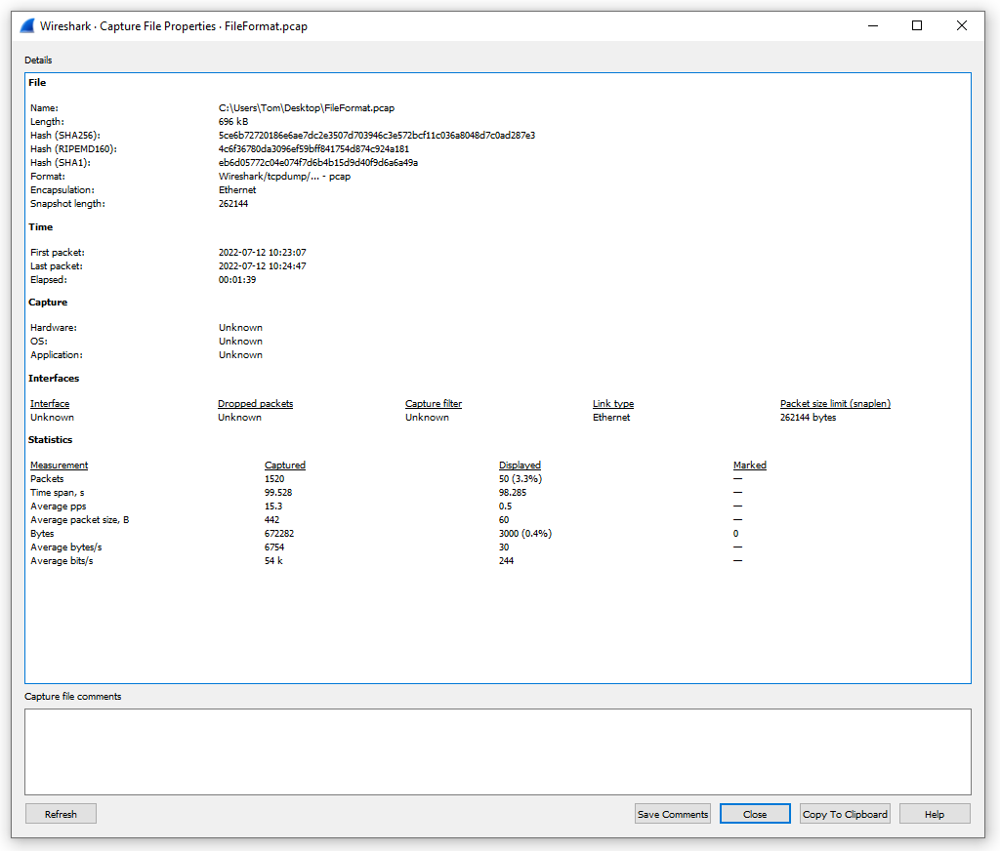
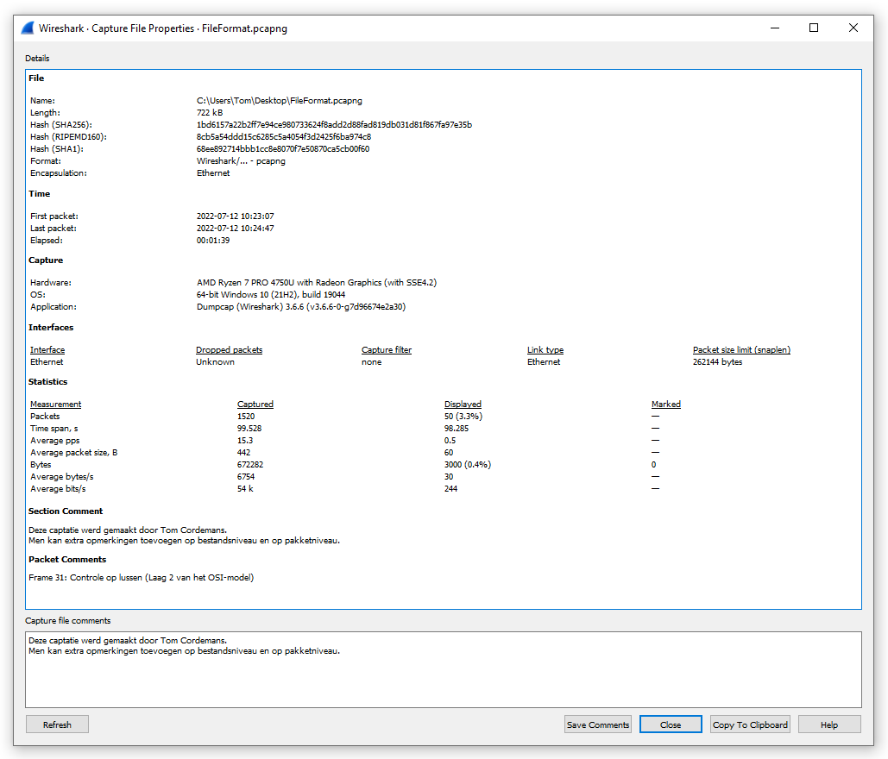

# Basisbegrippen

In de inleiding werd vermeld dat een network protocol analyzer netwerkverkeer kan capteren, analyseren en visualiseren.  
Het capteren en analyseren van netwerkverkeer zijn echter twee onafhankelijke taken.  

## Het capteren van netwerkverkeer

### Hoe en waar capteren?

Bij het capteren van netwerkverkeer wordt een kopie genomen van alle netwerkverkeer die zich verplaatst over een bepaalde verbinding. De belangrijkste vereisten zijn de accuraatheid en de de volledigheid van de captatie. Daarnaast mag het capteren geen invloed hebben op het netwerk.  

Standaard verwerkt een netwerkkaart enkel specifieke frames.
- Het destinatie MAC-adres is gelijk aan het eigen MAC-adres van de netwerkkaart.
- Het destinatie MAC-adres is gelijk aan het broadcast MAC-adres (FF:FF:FF:FF:FF:FF).
- Het destinatie MAC-adres is gelijk aan een specifiek multicast adres waarvan de netwerkkaart lid is.

Alle andere frames worden standaard genegeerd. Dit is uiteraard geen gewenst situatie bij het capteren van netwerkverkeer.
We willen namelijk alle frames capteren ongeacht het destinatie MAC-adres.  

Wanneer een netwerkkaart in "promiscuous mode" werkt, wordt het destinatie MAC-adres genegeerd en worden alle frame verwerkt ongeacht het destinatie MAC-adres. Deze mode is uiteraard cruciaal bij het capteren van netwerkverkeer.

Applicaties zoals TCPdump en Wireshark plaatsen de netwerkkaart standaard in "promiscuous mode".
Ter info: Dit is de reden waarom tijdens de installatie van Wireshark op een Microsoft besturingssysteem een extra stuurprogramma (Npcap) wordt geïnstalleerd.

Om accurater te meten kan men ook IPv4 en IPv6 uitschakelen op de netwerkkaart. Zo capteert men geen netwerkverkeer van het captatietoestel zelf.

Als we ons captatietoestel aansluiten op een switch, kunnen we onmogelijk al het netwerkverkeer capteren. De reden hiervoor is vrij simpel. Een switch filtert namelijk het netwerkverkeer op basis van het destinatie MAC-adres. 

Mogelijke werkwijzen bij het capteren:

1. Op het toestel zelf

Hierbij hebben we nog 2 opties:

- Het toestel beschikt over een eigen capteerfunctie. Als voorbeeld een screenshot van Fortinet firewall.  

  

- Men kan een network protocol analyzer installeren op het toestel. Denk bijvoorbeeld aan een kritische server of een specifieke client computer.  

  

2. Via een port mirror  

Sommige toestellen (switches, ...) hebben de optie om het netwerkverkeer van een bepaalde netwerkpoort te dupliceren.
Als voorbeeld een configuratie die wordt gebruikt bij een Cisco Catalyst 2960 switch.  

`Switch(config)# monitor session 1 source interface gigabitethernet0/1`  
`Switch(config)# monitor session 1 destination interface gigabitethernet0/2 encapsulation replicate`  

  

3. Via een tap  

Men kan ook opteren om een tap te plaatsen in het netwerk.  
Hieronder een foto van de hardware en de weergave van de opstelling.  

  

Let op: Bij het plaatsen van een tap veroorzaakt men kort een onderbreking van de netwerkfunctionaliteit!  

Een vaakgestelde vraag: _Op welke plaatsen in mijn netwerk moet ik precies capteren?_  

Dit is geen eenvoudige vraag. Accurate en actuele documentatie van het netwerk is hierbij noodzakelijk.  

Uiteraard zijn bepaalde locaties zeer relevant:  
- Aangezien een aanvaller hoogstwaarschijnlijk communiceert via het Internet is capteren ter hoogte van de edge firewall sterk aangewezen.
- Ook cruciale netwerktoestellen (Servers, IDS/IPS, WiFi-controller ...) zijn meestal logische plaatsen om netwerkverkeer te capteren.

Opmerking:  
Het capteren van netwerkverkeer heeft uiteraard ook consequenties. De nood aan opslagcapaciteit en respect voor de huidige regelgeving.  

### PCAP of PCAPng

PCAP (Packet Capture) is het meest universele bestandsformaat voor een captatie van netwerkverkeer. Bijna alle network protocol analyzers ondersteunen PCAP. In de loop der jaren werden nieuwe bestandsformaten geïntroduceerd.  
Als voorbeeld PCAPng. (ng => Next Generation)  

De belangrijkste voordelen van PCAPng zijn:
- Het toevoegen van opmerkingen in het captatiebestand.
- Aanwezigheid van metadata in het captatiebestand.

Deze informatie kan belangrijk zijn bij het maken van de rapportage van een incident.

  

  

Standaard wordt PCAPng gebruikt in Wireshark, Tshark, PacketTotal, ... .  
Uiteraard kunnen PCAPng geconverteerd worden naar PCAP en omgekeerd.  

## Het analyseren van netwerkverkeer

In deze fase wordt het netwerkverkeer gedissecteerd in verschillende netwerkprotocollen. Deze berg aan informatie kan daarna gebruikt worden om specifieke problematieken verder te onderzoeken. (Performantie, malware, datalekken, ...)  
Een vaak gebruikte applicatie voor de analyse van netwerkverkeer is Wireshark.  
Andere applicaties zijn o.a. NetworkMiner, ... .  

Uiteraard is een zeer goed kennis van netwerkprotocollen van cruciaal belang.  
Neem volgende vergelijking: Een CT-scan uitvoeren is relatief eenvoudig handeling, de verkregen informatie correct analyseren is daarentegen een ander paar mouwen.

Op het Internet zijn er verschillende bronnen voor PCAP-bestanden beschikbaar:
- [Wireshark Wiki](https://gitlab.com/wireshark/wireshark/-/wikis/SampleCaptures)
- [PacketLife](https://packetlife.net/captures)
- [NetResec](https://www.netresec.com/?page=PcapFiles)
- ...

Aan de hand van deze bestanden kan men verschillende protocollen bestuderen.  
Het volgende onderdeel van de cursus bevat een bootcamp Wireshark. Neem voldoende tijd om de basishandelingen onder de knie te krijgen.  

