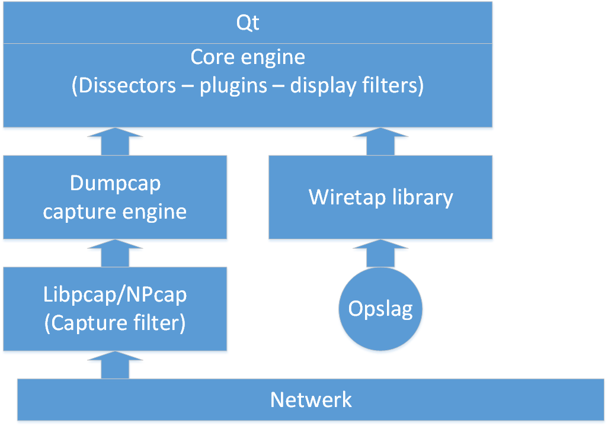

# Bootcamp Wireshark

Initieel was het niet de bedoeling om dit onderdeel op te nemen in deze cursus. Maar bij de try-outs cursus werd het snel duidelijk dat er onvoldoende kennis van Wireshark aanwezig was bij de cursisten.  
Dit onderdeel is optioneel naar gelang de aanwezige kennis.

## Wat is Wireshark?

Wireshark is een open source *packet sniffer* en *proctocol analyzer*. De kracht van Wireshark ligt voornamelijk in de capaciteiten om protocollen te analyseren en minder in het capteren van netwerkverkeer. Momenteel kan Wireshark meer dan 3000 protocollen dissecteren. 

Via onderstaand schema wordt de werking van Wireshark besproken.  

  

De “Qt” zorgt voor een platformonafhankelijke grafische interface voor Wireshark.  
De “Core engine” ondersteunt duizenden dissectors en plaatst alles in een “leesbaar” formaat. 
De “Dumpcap capture engine” bepaalt hoe het “capture process” start en stopt. 
De “Libpcap/NPcap” is een specifieke driver die de frames van het netwerk haalt en aan de 
“Dumpcap capture engine”aanbiedt. 
Wanneer je een opgeslagen pcapng-bestand in Wireshark opent, maak je gebruik van de “Wiretap library” om de opgeslagen frames aan de “Core engine” aan te bieden. 

## Wanneer Wireshark gebruiken?

De meest voorkomende taken waarbij we Wireshark gebruiken: 
- Analyse van het netwerkverkeer (voorbeeld: top talkers, …) 
- Troubleshooting (voorbeeld: vertraagd netwerk, … ) 
- Analyse van beveiligingsproblemen (voorbeeld: verdachte hosts, …) 
- Analyse van applicaties (voorbeeld: bandbreedte gebruik, …) 
- ...

Let op: Met Wireshark kan men enkel zaken vaststellen. Men kan geen problemen oplossen met Wireshark. Daarvoor zullen andere ingrepen noodzakelijk zijn. Als voorbeeld: aanpassing aan de regels op de firewall. 

## Basishandelingen

Aan de hand van enkele oefeningen zullen we de meest courante handelingen overlopen. 

Vooraleer we starten met deze oefening zullen we een nieuw profiel aanmaken.
Daarna zullen we enkele instellingen aanpassen die zullen helpen efficiënter te werken.
Bekijk onderstaande video's en voer de stappen gelijktijdig uit op uw toestel.

[Video - Aanmaken van een eigen profiel](https://opleiding-cybersecurity.be/PROFIEL.mkv)

Vanaf nu kunnen we ons persoonlijk profiel verder aanpassen aan onze wensen.

Aan de hand van onderstaande oefening worden basishandelingen uitgelegd.
Bekijk onderstaande video en voer de stappen gelijktijdig uit op uw toestel.

[Bestand - KOLOM.PCAPng](https://opleiding-cybersecurity.be/Kolom.pcapng)  

[Video - KOLOM.PCAPng](https://opleiding-cybersecurity.be/KOLOM.mkv)  

