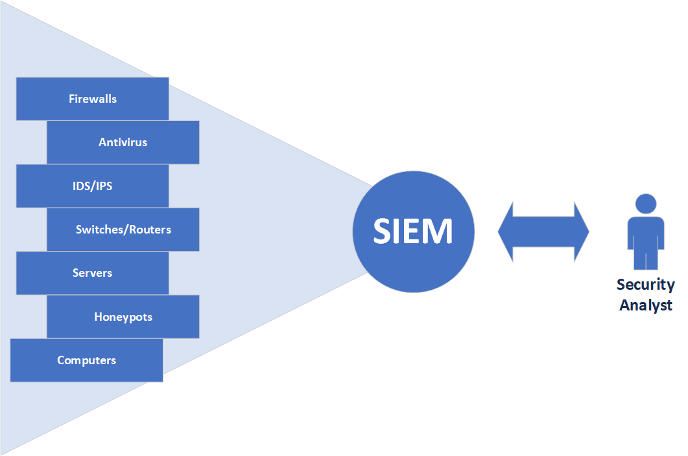
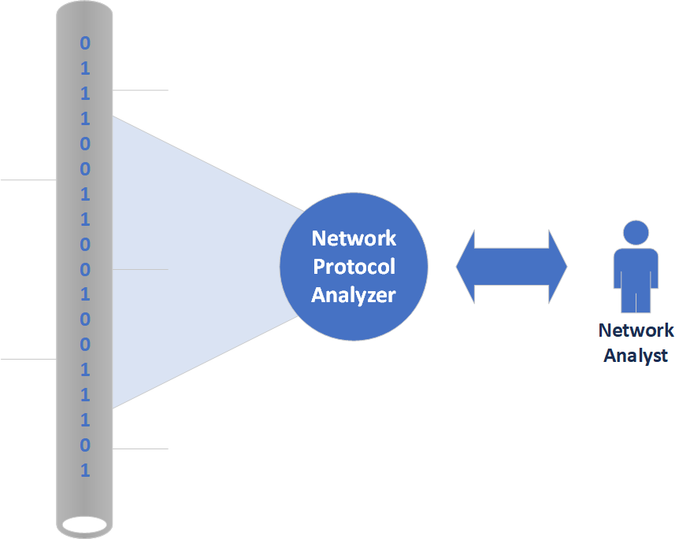

# Inleiding

In praktijk zien we heel vaak een verkeerd gebruik van network protocol analyzers.

Aan de hand van een vergelijking zal ik proberen het correct gebruik van een network protocol analyzer uit te leggen.
In een bos vermoedt men de aanwezigheid van een schimmel die bepaalde planten aantast. Om een beter beeld te verkrijgen omtrent de omvang van de huidige schade zal men over het bos met een drone vliegen en zo de aangetaste planten in kaart brengen. Nadien zal men de deze aangetaste planten bestuderen via een microscoop om meer informatie te verzamelen omtrent de specifieke schimmel. Eenmaal men voldoende kennis heeft omtrent deze schimmel kan men preventieve en curatieve maatregelen nemen om deze schimmel te bestrijden.

In deze vergelijking is de microscoop een network protocol analyzer en de drone een SIEM. De initiële stap bij het onderzoek naar cybersecurity threats zal dus nooit het gebruik zijn van een network protocol analyzer!

## SIEM versus Network Protocol Analyzer.

Een SIEM (Security Information and Event Management)  is software of een service die gegevens van verschillende applicaties en apparatuur centraal verzamelt, analyseert en visualiseert.

Een network protocol analyzer is software of een service die netwerkverkeer capteert, analyseert en visualiseert.

Een SIEM wordt hoofdzakelijk gebruikt in de context van cybersecurity threats. Een network protocol analyzer daarentegen kan ruimer ingezet worden. Vaak wordt een network protocol analyzer gebruik bij troubleshooting. (Problemen met de performantie van het netwerk, ... )

## Cyber Kill Chain Model

Om een cybersecurity gerelateerde activiteit voor te stellen, maakt men vaak gebruik van het Cyber Kill Chain Model.

Meer info omtrent dit model vindt u op volgende [link](https://www.lockheedmartin.com/en-us/capabilities/cyber/cyber-kill-chain.html).

Oefening 1:   
Bij welke onderdelen van het Cyber Kill Chain Model kan er netwerkverkeer gegenereerd worden? Probeer ook een omschrijving te geven van het netwerkverkeer.

- Reconnaissance:
- Weaponization:
- Delivery:
- Exploitation:
- Installation:
- Command and Control:
- Actions on Objective:

[Oplossing](https://opleiding-cybersecurity.be/OEFENING1.pdf)

## Waarschuwing  

**Het analyseren van netwerkverkeer is niet zonder risico. Men kan bestanden extraheren uit netwerkverkeer.**
**Indien een bestand malware bevat, kan dit tot ongewenste consequenties leiden.**  
**Enige voorzichtigheid is hierbij wel geboden.**  

Als preventieve maatregel kan men opteren voor een volledig gescheiden omgeving om netwerkanalyses uit te voeren.
