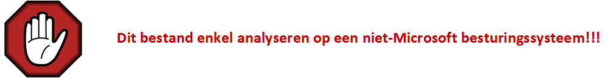

# Threat Analysis

Aangezien netwerkverkeer malware kan bevatten, is er steeds een risico aanwezig. Een volledig gescheiden omgeving is daarom aangewezen. Daarnaast wordt er vaak ook een niet-Microsoft besturingssysteem aanbevolen. Zo verkleinen we de kans op besmetting van het systeem en verspreiding via het netwerk.   

Een mogelijke werkwijze is het gebruik maken van een virtuele machine.  
[Kali Linux](https://www.kali.org/get-kali/#kali-virtual-machines)

## Wireshark tweaken  

Wireshark kan gebruikt worden voor verschillende taken. Als voorbeeld: Troubleshooting, security threats analysis, ... .
We gebruiken dezelfde data (frames) maar we stellen andere vragen. Daarom een specifieke profiel per taak een noodzaak.

Sommigen opteren om zelf hun profiel samen te stellen. Anderen maken gebruik van profielen die beschikbaar gesteld worden door derden.


Oefening 8:  
In deze oefening importen we een security profiel in Wireshark. Hierbij maken reeds gebruik van Kali linux virtuele machine.   
[Video - SECURITY_PROFILE.MKV](https://opleiding-cybersecurity.be/SECURITY_PROFILE.mkv)  
[Bestand - SECURITYV5.ZIP](https://opleiding-cybersecurity.be/SecurityV5.zip) 


Oefening 9:  
Probeer aan de hand van de verschillende profielen (default versus SecurityV5) de anomalie in een specifiek frame te vinden.  
[Video - CHECK-ICMP.MKV](https://opleiding-cybersecurity.be/CHECK-ICMP.mkv)  
[Bestand - CHECK-ICMP.PCAPng](https://opleiding-cybersecurity.be/CHECK-ICMP.PCAPng) 

## Controle op verdachte bestanden

Eenmaal een bestand uit een captatie wordt gehaald, is het meer dan wenselijk dit bestand te controleren. Hierbij kan men gebruik maken van verschillende websites:   
[VirusTotal](https://www.virustotal.com/gui/home/search)  
[Talos](https://www.talosintelligence.com/talos_file_reputation)   
[URLhaus](https://urlhaus.abuse.ch/browse/)   

Om datalekken te vermijden is het aangewezen om gebruik te maken van een hash. Daarnaast is een hash meestal zeer klein t.o.v. van het originele bestand.

De werkwijze via PowerShell:   
```
C:\Users\Tom\Desktop> Get-ChildItem .\Test.jpg


    Directory: C:\Users\Tom\Desktop


Mode                 LastWriteTime         Length Name
----                 -------------         ------ ----
-a----        27/07/2022     10:55        4458380 Test.jpg


C:\Users\Tom\Desktop> Get-FileHash .\Test.jpg

Algorithm       Hash                                                                   Path
---------       ----                                                                   ----
SHA256          BF46477937C830AEF1203859F55E935C356B79052E57AE6C6D0F5CA2CA05FB89       C:\Users\Tom\Desktop\Test.jpg


C:\Users\Tom\Desktop>
```
De werkwijze via Linux:

```
┌──(kali㉿kali)-[~/Desktop]
└─$ ls Test.jpg -l 
-rw-rw-rw- 1 kali kali 4458380 Aug 18 08:24 Test.jpg
                                                                                                                
┌──(kali㉿kali)-[~/Desktop]
└─$ sha256sum Test.jpg 
bf46477937c830aef1203859f55e935c356b79052e57ae6c6d0f5ca2ca05fb89  Test.jpg
                                                                                                                
┌──(kali㉿kali)-[~/Desktop]
└─$ 
```  
De hash kan nu aangeboden worden aan VirusTotal of andere "file reputation" diensten.  
Als samenwatting onderstaande video:  
[Video - EICAR.MKV](https://opleiding-cybersecurity.be/EICAR.mkv)  

## Indicators of compromise (IoC)

Malware kunnen we gaan identificeren aan de hand van bepaalde indicatoren. (IoC)   
Voorbeelden zijn:
- Ongewone DNS lookups  
- Verdachte bestanden  
- Verdachte processen  
- Malafide IP-adressen   
- Malafide domeinnamen   
- Veelvuldig benaderen van een specifiek bestand   
- Verdachte handelingen op een systeem door een geprivilegieerd gebruikersaccount   
- Onverwachte software updates   
- Dataverkeer op niet-courante poorten
- Hashes van bestanden die verwijzen naar malware
- Misbruik van netwerkprotocollen
- Een groot aantal mislukte aanmeldpogingen
- ...

## Casus

In deze casus bespreken Remcos RAT. Remcos is acroniem voor *Remote Control & Surveillance* en RAT staat voor *Remote Access Trojan*.   



Het captatiebestand is afkomstig van de website:   
[MALWARE-TRAFFIC-ANALYSIS.NET](https://www.malware-traffic-analysis.net/)   

In deze casus gebruiken we **2022-01-04 -- Recmos RAT infection from Excel file with macros**
Download het bestand *2022-01-04-Remcos-RAT-infection-traffic.pcap.zip*  


   

Zoals vermeld is het ZIP-bestand beveiligd. Het wachtwoord is [hier](https://www.malware-traffic-analysis.net/about.html) te vinden.

De context van deze casus:   
Een gebruiker heeft vanaf zijn computer (10.1.4.101) op 4 januari 2022 (21u24) een mail geopend in Outlook die een Excel-bestand (Payment Remettande Advice.xlsb) bevatte. De gebruiker heeft daarna het Excel-bestand met macro geopend. Via deze macro werd een verbinding met Onderdrive gemaakt.

Open het bestand en controleer of het security profiel actief is.


Hieronder een mogelijke werkwijze om de casus te analyseren.   

Aan de hand van screenshots en bijhorende uitleg op frame niveau wordt de volledige captatie gedetailleerd besproken.

### Onderdeel 1 van de casus   

   

**Frame 1:**   
Een DNS-query afkomstig van de computer van de gebruiker (10.1.4.101) naar de interne DNS-server (10.1.14.1) voor de domeinnaam onedrive.live.com.   

*Opmerking: Indien men gebruik maakt van interne DNS-servers is het logisch dat men de computers van de gebruikers enkel laat communiceren met deze interne DNS-servers. Zo beperkt men de kans op misbruik via externe DNS-servers.*    

**Frame 2:**   
Een DNS-response afkomstig van de interne DNS-server. Met als antwoord onedrive.live.com komt overeen met het publiek IPv4-adres 13.107.42.13.

*Opmerking: Indien men twijfelt aan de reputatie van een publiek IPv4-adres kan men gebruik maken van verschillende websites. Enkele voorbeelden zijn [WHO.IS](https://who.is/) of [Talos](https://www.talosintelligence.com/)*.  

  

*Tip: In het Security profiel kan men gebruik maken van een Filter Button die enkel netwerkverkeer naar externe DNS-servers zal tonen. Zo krijgt men zeer snel een beeld op eventueel ongewenst netwerkverkeer.*   

    

### Onderdeel 2 van de casus   

   

**Frame 6:**

Een HTTP GET request naar *http://onedrive.live.com/download?cid=64F8294A00286885&resid=64F8294A00286885%21770&authkey=ABI3zrc6BsVUKxU*.   

Belangrijke vragen zijn:
- Is onedrive.live.com betrouwbaar?
- Is er een User-Agent aanwezig?  

Om de eerste vraag te beantwoorden, maakt men gebruik van verschillende websites zoals:
- [VirusTotal](https://www.virustotal.com/gui/home/url)  
- [Talos](https://www.talosintelligence.com/)   
- [URLhaus](https://urlhaus.abuse.ch/browse/)  

Men kan concluderen dat deze website legitiem is, maar dat Microsoft OneDrive ook gebruikt wordt om malware te verspreiden.

Op de tweede vraag moeten men negatief antwoorden. Dit is verdacht. Wanneer men een website bezoekt via een web browser (Google Chrome, Firefox, ...) bevat de HTTP GET request altijd een User-Agent.   
Onderstaande figuur als voorbeeld.  

   

Om meer informatie bekomen omtrent specifieke User-Agents, kan men gebruik maken van [User-Agents.net](https://user-agents.net/)   

   

**Frame 8:**   

Er volgt een redirection naar *https://onedrive.live.com/download?cid=64F8294A00286885&resid=64F8294A00286885%21770&authkey=ABI3zrc6BsVUKxU*

*Opmerking: Een redirection van HTTP naar HTTPS is zeer courant. Dit is dus niet verdacht.*

### Onderdeel 3 van de casus

   

**Frame 13:**   

Een HTTPS-verbinding is versleuteld. Toch is er nog voldoende informatie beschikbaar om een beeld te vormen over de verbinding. Frame 18 bevat de *Client Hello* boodschap. Naast de beschikbare *Cipher Suites* kunnen we ook de domeinnaam achterhalen. De domeinnaam is opnieuw *onedrive.live.com*.

*Tip: Bepaalde velden zitten diep verscholen in de headers. Het is daarom gewenst om cruciale informatie als kolom te visualiseren of via een Filter Button beschikbaar te stellen.*

   

   

**Frame 18:**

Hier vinden we de *Server Hello* boodschap terug. Naast de gebruikte *Cipher Suite* vindt men hier alle informatie omtrent de certificaten terug. 
Belangrijke velden zijn:   
```
issuer: rdnSequence (0)
    rdnSequence: 3 items (id-at-commonName=Microsoft RSA TLS CA 01,id-at-organizationName=Microsoft Corporation,id-at-countryName=US)
        RDNSequence item: 1 item (id-at-countryName=US)
            RelativeDistinguishedName item (id-at-countryName=US)
                Id: 2.5.4.6 (id-at-countryName)
                CountryName: US
        RDNSequence item: 1 item (id-at-organizationName=Microsoft Corporation)
            RelativeDistinguishedName item (id-at-organizationName=Microsoft Corporation)
                Id: 2.5.4.10 (id-at-organizationName)
                DirectoryString: printableString (1)
                    printableString: Microsoft Corporation
        RDNSequence item: 1 item (id-at-commonName=Microsoft RSA TLS CA 01)
            RelativeDistinguishedName item (id-at-commonName=Microsoft RSA TLS CA 01)
                Id: 2.5.4.3 (id-at-commonName)
                DirectoryString: printableString (1)
                    printableString: Microsoft RSA TLS CA 01
validity
    notBefore: utcTime (0)
        utcTime: 2021-08-13 07:38:24 (UTC)
    notAfter: utcTime (0)
        utcTime: 2022-08-13 07:38:24 (UTC)
subject: rdnSequence (0)
    rdnSequence: 1 item (id-at-commonName=onedrive.com)
        RDNSequence item: 1 item (id-at-commonName=onedrive.com)
            RelativeDistinguishedName item (id-at-commonName=onedrive.com)
                Id: 2.5.4.3 (id-at-commonName)
                DirectoryString: printableString (1)
                    printableString: onedrive.com
```   
Na onderzoek kunnen we stellen dat het bijhorend certificaat correct en geldig was op 4 januari 2022.

### Onderdeel 4 van de casus   

   

**Frame 31:**   

Er werd een nieuwe HTTPS-verbinding naar *diufxw.sn.files.1drv.com* gestart.   
We moeten opnieuw dezelfde vragen stellen:   
- Is *diufxw.sn.files.1drv.com* betrouwbaar?
- Is bijhorend certificaat correct en geldig? 

*Tip: Gebruik dezelfde werkwijze als bij de vorige onderdelen.*

Na onderzoek kunnen we stellen dat de domeinnaam *diufxw.sn.files.1drv.com* betrouwbaar is en het bijhorend certificaat correct en geldig was op 4 januari 2022.

### Onderdeel 5 van de casus   


**Frame 52:**   

De HTTPS-connectie uit onderdeel 4 wordt beëindigd door de computer van de gebruiker.   

*Opmerking: Waarom staat dit in het rood?*
*[Coloring Rule Name: TCP RST]*
*[Coloring Rule String: tcp.flags.reset eq 1]*
*Een TCP-RST wordt vaak gebruikt om een verbinding snel af te breken. Het zorgt voor minder overhead dan bij een TCP-FIN.*
*In de huidige context is dit verdacht.*

**Frame 53:**   
De HTTPS-connectie uit onderdeel 3 wordt beëindigd door de computer van de gebruiker.  

**Frame 54:**
De HTTP-connectie uit onderdeel 2 wordt beëindigd door de computer van de gebruiker.  

### Onderdeel 6 van de casus   


**Frame 58:**   

Een HTTP GET request naar *http://64.188.19.241/atcn.jpg*.   
Volgende vragen opportuun:   
- Is 64.188.19.241 betrouwbaar?
- Waarom gebruikt men een IPv4-adres i.p.v. een domeinnaam?
- Is atcn.jpg werkelijk een JPEG?
- Is er een User-Agent aanwezig?

Het antwoord op de eerste vraag bekomt men door het IPv4-adres in te geven bij enkele *Threat Intelligence* websites. De resultaten kunnen zeker tegenstrijdig zijn. Daarom is het aangewezen meerdere websites te raadplegen.   


