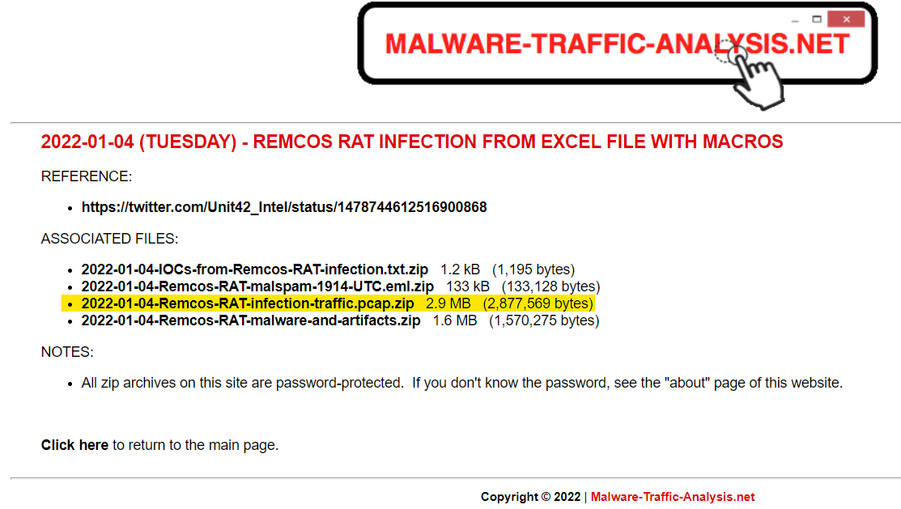

# Threat Analysis

Aangezien netwerkverkeer malware kan bevatten, is er steeds een risico aanwezig. Een volledig gescheiden omgeving is daarom aangewezen. Daarnaast wordt er vaak ook een niet-Microsoft besturingssysteem aanbevolen. Zo verkleinen we de kans op besmetting van het systeem en verspreiding via het netwerk.   

Een mogelijke werkwijze is het gebruik maken van een virtuele machine.  
[Kali Linux](https://www.kali.org/get-kali/#kali-virtual-machines)

## Wireshark tweaken  

Wireshark kan gebruikt worden voor verschillende taken. Als voorbeeld: Troubleshooting, security threats analysis, ... .
We gebruiken dezelfde data (frames) maar we stellen andere vragen. Daarom is een specifiek profiel per taak een noodzaak.

Sommigen opteren om zelf hun profiel samen te stellen. Anderen maken gebruik van profielen die beschikbaar gesteld worden door derden.

   
In deze oefening importen we een security profiel in Wireshark. Hierbij maken we reeds gebruik van een Kali Linux virtuele machine.   
[Video - SECURITY_PROFILE.MKV](https://opleiding-cybersecurity.be/SECURITY_PROFILE.mkv)  
[Bestand - SECURITYV7.ZIP](https://opleiding-cybersecurity.be/SecurityV7.zip)  


   
Probeer aan de hand van de verschillende profielen (default versus SecurityV5) de anomalie in een specifiek frame te vinden.  
[Video - CHECK-ICMP.MKV](https://opleiding-cybersecurity.be/CHECK-ICMP.mkv)  
[Bestand - CHECK-ICMP.PCAPng](https://opleiding-cybersecurity.be/CHECK-ICMP.PCAPng) 

## Controle op verdachte bestanden

Eenmaal een bestand uit een captatie wordt gehaald, is het meer dan wenselijk dit bestand te controleren. Hierbij kan je gebruik maken van verschillende websites:   
[VirusTotal](https://www.virustotal.com/gui/home/search)  
[Talos](https://www.talosintelligence.com/talos_file_reputation)   
[URLhaus](https://urlhaus.abuse.ch/browse/)   

:::tip
Om datalekken te vermijden is het aangewezen om gebruik te maken van een hash. 

Een hash is een one-way functie die van een bepaalde input, i.e. het te hashen bestand, omzet naar een reeks karakters. Een one-way functie betekent dat het originele bestand niet meer eenvoudig te achterhalen valt. Daarnaast is een hash meestal zeer klein t.o.v. van het originele bestand.

Een hash is deterministisch wat inhoudt dat twee maal dezelfde input eenzelfde hash zullen opleveren. Een kleine wijziging van de input zal echter een volledig verschillende hash opleveren.
:::

De werkwijze via PowerShell:   
```
C:\Users\Tom\Desktop> Get-ChildItem .\Test.jpg


    Directory: C:\Users\Tom\Desktop


Mode                 LastWriteTime         Length Name
----                 -------------         ------ ----
-a----        27/07/2022     10:55        4458380 Test.jpg


C:\Users\Tom\Desktop> Get-FileHash .\Test.jpg

Algorithm       Hash                                                                   Path
---------       ----                                                                   ----
SHA256          BF46477937C830AEF1203859F55E935C356B79052E57AE6C6D0F5CA2CA05FB89       C:\Users\Tom\Desktop\Test.jpg


C:\Users\Tom\Desktop>
```
De werkwijze via Linux:

```
┌──(kali㉿kali)-[~/Desktop]
└─$ ls Test.jpg -l 
-rw-rw-rw- 1 kali kali 4458380 Aug 18 08:24 Test.jpg
                                                                                                                
┌──(kali㉿kali)-[~/Desktop]
└─$ sha256sum Test.jpg 
bf46477937c830aef1203859f55e935c356b79052e57ae6c6d0f5ca2ca05fb89  Test.jpg
                                                                                                                
┌──(kali㉿kali)-[~/Desktop]
└─$ 
```  
De hash kan nu aangeboden worden aan VirusTotal of andere "file reputation" diensten.  
Als samenvatting onderstaande video:  
[Video - EICAR.MKV](https://opleiding-cybersecurity.be/EICAR.mkv)  

## Indicators of compromise (IoC)

Malware kunnen we gaan identificeren aan de hand van bepaalde indicatoren. (IoC)   
Voorbeelden zijn:
- Ongewone DNS lookups  
- Verdachte bestanden  
- Verdachte processen  
- Malafide IP-adressen   
- Malafide domeinnamen   
- Veelvuldig benaderen van een specifiek bestand   
- Verdachte handelingen op een systeem door een geprivilegieerd gebruikersaccount   
- Onverwachte software updates   
- Dataverkeer op niet-courante poorten
- Hashes van bestanden die verwijzen naar malware
- Misbruik van netwerkprotocollen
- Een groot aantal mislukte aanmeldpogingen
- ...

## Casus

In deze casus bespreken Remcos RAT. Remcos is acroniem voor *Remote Control & Surveillance* en RAT staat voor *Remote Access Trojan*.   

:::danger
Dit bestand enkel analyseren op een niet-Windows besturingssysteem!
:::

Het captatiebestand is afkomstig van de website:   
[MALWARE-TRAFFIC-ANALYSIS.NET](https://www.malware-traffic-analysis.net/)   

In deze casus gebruiken we **2022-01-04 -- Remcos RAT infection from Excel file with macros**   
Download het bestand *2022-01-04-Remcos-RAT-infection-traffic.pcap.zip*  


   

Zoals vermeld is het ZIP-bestand beveiligd. Het wachtwoord is [hier](https://www.malware-traffic-analysis.net/about.html) te vinden.

De context van deze casus:   
Een gebruiker heeft vanaf zijn computer (10.1.4.101) op 4 januari 2022 (21u24) een mail geopend in Outlook die een Excel-bestand (Payment Remettande Advice.xlsb) bevatte. De gebruiker heeft daarna het Excel-bestand met macro geopend. Via deze macro werd een verbinding met OneDrive gemaakt.

Open het bestand en controleer of het security profiel actief is.


Hieronder een mogelijke werkwijze om de casus te analyseren.   

Aan de hand van screenshots en bijhorende uitleg op frame niveau wordt de volledige captatie gedetailleerd besproken.

### Onderdeel 1 van de casus   

   

**Frame 1:**   
Een DNS-query afkomstig van de computer van de gebruiker (10.1.4.101) naar de interne DNS-server (10.1.14.1) voor de domeinnaam onedrive.live.com.   

:::tip
 Indien je gebruik maakt van interne DNS-servers is het logisch dat je de computers van de gebruikers enkel laat communiceren met deze interne DNS-servers. Zo beperk je de kans op misbruik via externe DNS-servers.
 :::

**Frame 2:**   
Een DNS-response afkomstig van de interne DNS-server. Met als antwoord onedrive.live.com komt overeen met het publiek IPv4-adres 13.107.42.13.

:::tip
Indien je twijfelt aan de reputatie van een publiek IPv4-adres kan je gebruik maken van verschillende websites. Enkele voorbeelden zijn [WHO.IS](https://who.is/) of [Talos](https://www.talosintelligence.com/).
:::  

  


:::tip
 In het Security profiel kan je gebruik maken van een Filter Button die enkel netwerkverkeer naar externe DNS-servers zal tonen. Zo krijg je zeer snel een beeld op eventueel ongewenst netwerkverkeer.
 :::


    

### Onderdeel 2 van de casus   

   

**Frame 6:**

Een HTTP GET request naar *http://onedrive.live.com/download?cid=64F8294A00286885&resid=64F8294A00286885%21770&authkey=ABI3zrc6BsVUKxU*.   

Belangrijke vragen zijn:
1. Is onedrive.live.com betrouwbaar?
2. Is er een User-Agent aanwezig?  

Om de eerste vraag te beantwoorden, maak je gebruik van verschillende websites zoals:
- [VirusTotal](https://www.virustotal.com/gui/home/url)  
- [Talos](https://www.talosintelligence.com/)   
- [URLhaus](https://urlhaus.abuse.ch/browse/)  

Je kan concluderen dat deze website legitiem is, maar dat Microsoft OneDrive ook gebruikt wordt om malware te verspreiden.

Op de tweede vraag moet je negatief antwoorden. Dit is potentieel verdacht. Wanneer je een website bezoekt via een web browser (Google Chrome, Firefox, ...) bevat de HTTP GET request altijd een User-Agent.   
Onderstaande figuur als voorbeeld.  

   

Om meer informatie bekomen omtrent specifieke User-Agents, kan je gebruik maken van [User-Agents.net](https://user-agents.net/lookup)   

   

**Frame 8:**   

Er volgt een redirection naar *https://onedrive.live.com/download?cid=64F8294A00286885&resid=64F8294A00286885%21770&authkey=ABI3zrc6BsVUKxU*

:::tip
Een redirection van HTTP naar HTTPS is zeer courant. Dit is dus niet verdacht.
:::

### Onderdeel 3 van de casus

   

**Frame 13:**   

Een HTTPS-verbinding is versleuteld. Toch is er nog voldoende informatie beschikbaar om een beeld te vormen over deze verbinding. Frame 13 bevat de *Client Hello* boodschap. Naast de beschikbare *Cipher Suites* kunnen we ook de domeinnaam achterhalen. De domeinnaam is opnieuw *onedrive.live.com*.

:::tip
Bepaalde velden zitten diep verscholen in de headers. Het is daarom gewenst om cruciale informatie als kolom te visualiseren of via een Filter Button beschikbaar te stellen.
:::

   

   

**Frame 18:**

Hier vinden we de *Server Hello* boodschap terug. Naast de gebruikte *Cipher Suite* vind je hier alle informatie omtrent de certificaten terug. 
Belangrijke velden zijn:   
```
issuer: rdnSequence (0)
    rdnSequence: 3 items (id-at-commonName=Microsoft RSA TLS CA 01,id-at-organizationName=Microsoft Corporation,id-at-countryName=US)
        RDNSequence item: 1 item (id-at-countryName=US)
            RelativeDistinguishedName item (id-at-countryName=US)
                Id: 2.5.4.6 (id-at-countryName)
                CountryName: US
        RDNSequence item: 1 item (id-at-organizationName=Microsoft Corporation)
            RelativeDistinguishedName item (id-at-organizationName=Microsoft Corporation)
                Id: 2.5.4.10 (id-at-organizationName)
                DirectoryString: printableString (1)
                    printableString: Microsoft Corporation
        RDNSequence item: 1 item (id-at-commonName=Microsoft RSA TLS CA 01)
            RelativeDistinguishedName item (id-at-commonName=Microsoft RSA TLS CA 01)
                Id: 2.5.4.3 (id-at-commonName)
                DirectoryString: printableString (1)
                    printableString: Microsoft RSA TLS CA 01
validity
    notBefore: utcTime (0)
        utcTime: 2021-08-13 07:38:24 (UTC)
    notAfter: utcTime (0)
        utcTime: 2022-08-13 07:38:24 (UTC)
subject: rdnSequence (0)
    rdnSequence: 1 item (id-at-commonName=onedrive.com)
        RDNSequence item: 1 item (id-at-commonName=onedrive.com)
            RelativeDistinguishedName item (id-at-commonName=onedrive.com)
                Id: 2.5.4.3 (id-at-commonName)
                DirectoryString: printableString (1)
                    printableString: onedrive.com
```   
Na onderzoek kunnen we stellen dat het bijhorend certificaat correct en geldig was op 4 januari 2022.

### Onderdeel 4 van de casus   

   

**Frame 31:**   

Er werd een nieuwe HTTPS-verbinding naar *diufxw.sn.files.1drv.com* gestart.   
We moeten opnieuw dezelfde vragen stellen:   
1. Is *diufxw.sn.files.1drv.com* betrouwbaar?
2. Is bijhorend certificaat correct en geldig? 

*Tip: Gebruik dezelfde werkwijze als bij de vorige onderdelen.*

Na onderzoek kunnen we stellen dat de domeinnaam *diufxw.sn.files.1drv.com* betrouwbaar is en het bijhorend certificaat correct en geldig was op 4 januari 2022.

### Onderdeel 5 van de casus   


**Frame 52:**   

De HTTPS-connectie uit onderdeel 4 wordt beëindigd door de computer van de gebruiker.   

*Opmerking: Waarom staat dit in het rood?*  
*[Coloring Rule Name: TCP RST]*   
*[Coloring Rule String: tcp.flags.reset eq 1]*   
*Een TCP-RST wordt vaak gebruikt om een verbinding snel af te breken. Het zorgt voor minder overhead dan bij een TCP-FIN.* *In de huidige context is dit niet verdacht.*   

**Frame 53:**   
De HTTPS-connectie uit onderdeel 3 wordt beëindigd door de computer van de gebruiker.  

**Frame 54:**
De HTTP-connectie uit onderdeel 2 wordt beëindigd door de computer van de gebruiker.  

### Onderdeel 6 van de casus   


**Frame 58:**   

Er werd een HTTP GET request naar *http://64.188.19.241/atcn.jpg* gestart.   
Volgende vragen opportuun:   
1. Is 64.188.19.241 betrouwbaar?
2. Waarom gebruik je een IPv4-adres i.p.v. een domeinnaam?
3. Is atcn.jpg werkelijk een JPEG?
4. Is er een User-Agent aanwezig?

Het antwoord op de eerste vraag bekom je door het IPv4-adres (64.188.19.241) in te geven bij enkele *Threat Intelligence* websites. De resultaten kunnen zeker tegenstrijdig zijn. Daarom is het aangewezen meerdere websites te raadplegen.  

   

Na onderzoek blijkt dat het IPv4-adres (64.188.19.241) ooit gebruikt werd voor het verspreiden van malware.   

Het antwoord op de tweede vraag is meer principieel. Mensen gebruiken eerder domeinnamen dan IPv4-adressen in een webbrowser. Onze waakzaamheid zal dus verhogen bij een dergelijke indicatie.   

Het antwoord op de derde vraag kan via verschillende opties gevonden worden.   
Mogelijke werkwijzen zijn:
- Follow TCP stream   
   
Hierboven is duidelijk te zien dat het bestand atcn.jpg geen JPEG is.  

- Het exporteren van het object via File - Export objects   
    

   
Ook hier is het duidelijk day atcn.jpg geen JPEG is.

- Color rules   
   
  
Een alternatieve manier is werken met een color rule. Deze wordt actief zodra er een match is.
Zodra de string *.exe* of *This program* aanwezig is in een frame, wordt het frame gekleurd.

Het antwoord op de vierde vraag is positief. We vinden de User-Agent terug in de HTTP-sectie.   
   

  
Het resultaat is eerder verdacht. Internet Explorer 11 is een verouderde web browser en wordt zelden nog gebruikt.

**Frame 66:**   
De HTTP-connectie wordt beëindigd door de computer van de gebruiker.   

### Onderdeel 7 van de casus  


**Frame 70:**   
Er werd terug een HTTP GET request naar *http://104.223.119.167/calient.jpg* gestart.   
Volgende vragen zijn opportuun:   
1. Is 104.223.119.167 betrouwbaar?
2. Waarom gebruik je een IPv4-adres i.p.v. een domeinnaam?
3. Is calient.jpg werkelijk een JPEG?
4. Is er een User-Agent aanwezig?

Gebruik dezelfde werkwijze als bij onderdeel 6 van de casus.   

**Frame 2615:**   
De HTTP-connectie wordt beëindigd door de computer van de gebruiker.  

### Onderdeel 8 van de casus

   

**Frame 2597:**   
Een DNS-query afkomstig van de computer van de gebruiker (10.1.4.101) naar de interne DNS-server (10.1.14.1) voor de domeinnaam *shiestynerd.dvrlists.com*.   

**Frame 2598:**   
Een DNS-response afkomstig van de interne DNS-server met als antwoord *shiestynerd.dvrlists.com*. Dit komt overeen met het publiek IPv4-adres 79.134.225.79.

:::tip 
Indien je twijfelt aan de reputatie van een publiek IPv4-adres kan je gebruik maken van verschillende websites. Enkele voorbeelden zijn [WHO.IS](https://who.is/) of [Talos](https://www.talosintelligence.com/).
:::

### Onderdeel 9 van de casus   

Via de filter button *HTTP(S)* geeft Wireshark onderstaande informatie weer.

   

**Frame 2602, 2627, 2628 en 3134:**   

Er werden verschillende HTTPS-connecties zonder *"Server Name"* gestart.   
We stellen onmiddellijk volgende vragen:   
1. Waarom is er geen *"Server name"* aanwezig?   
2. Waarom TCP-poort 10174?   
3. Is 79.134.225.79 betrouwbaar?   
4. Kunnen we informatie ophalen omtrent het certificaat van de server?   

Het antwoord op de eerste vraag is terug principieel. Mensen gebruiken eerder domeinnamen dan IPv4-adressen in een webbrowser. Onze waakzaamheid zal dus verhogen bij een dergelijke indicatie.   

TCP-poort 10174 is zeker geen standaard poort voor TLS-verkeer. We kunnen dus op tweede vraag geen antwoord geven. Hierdoor zal onze waakzaamheid terug verhogen.   

Het antwoord op de derde vraag bekom je door het IPv4-adres (79.134.225.79) in te geven bij enkele *Threat Intelligence* websites. De resultaten kunnen zeker tegenstrijdig zijn. Daarom is het aangewezen meerdere websites te raadplegen.  

   

Na onderzoek blijkt dat het IPv4-adres (79.134.225.79) niet echt betrouwbaar is.   

De vierde vraag kan je beantwoorden door bijvoorbeeld frame 2604 te onderzoeken. Informatie zoals issuer, validity en subject kan ons helpen bij het het bepalen of het certificaat correct geldig is.  

```
Frame 2604: 182 bytes on wire (1456 bits), 182 bytes captured (1456 bits)
Ethernet II, Src: Netgear_b6:93:f1 (20:e5:2a:b6:93:f1), Dst: HewlettP_1c:47:ae (00:08:02:1c:47:ae)
Internet Protocol Version 4, Src: 79.134.225.79, Dst: 10.1.4.101
Transmission Control Protocol, Src Port: 10174, Dst Port: 50048, Seq: 1, Ack: 161, Len: 128
Transport Layer Security
    TLSv1.3 Record Layer: Handshake Protocol: Server Hello
        Content Type: Handshake (22)
        Version: TLS 1.2 (0x0303)
        Length: 123
        Handshake Protocol: Server Hello
            Handshake Type: Server Hello (2)
            Length: 119
            Version: TLS 1.2 (0x0303)
            Random: b4b194e8b92debc9aef40167ebbbe14406b309fa776224c41858b1fb83950001
            Session ID Length: 0
            Cipher Suite: TLS_AES_128_GCM_SHA256 (0x1301)
            Compression Method: null (0)
            Extensions Length: 79
            Extension: key_share (len=69)
                Type: key_share (51)
                Length: 69
                Key Share extension
                    Key Share Entry: Group: secp256r1, Key Exchange length: 65
                        Group: secp256r1 (23)
                        Key Exchange Length: 65
                        Key Exchange: 04f2970c0b296725606ec7a8a133b34dc2744d32fd09474e352b767f46fb157c39657704…
            Extension: supported_versions (len=2)
                Type: supported_versions (43)
                Length: 2
                Supported Version: TLS 1.3 (0x0304)
            [JA3S Fullstring: 771,4865,51-43]
            [JA3S: eb1d94daa7e0344597e756a1fb6e7054]
```   

Het is duidelijk dat er geen informatie beschikbaar is omtrent het certificaat. Ook dit is verdacht.

### Conclusie van de casus:
Zonder diepgaande kennis van de verschillende protocollen is het onmogelijk dergelijke aanvallen correct te analyseren. Daarnaast is een specifiek *CyberSecurity* profiel binnen Wireshark essentieel om de efficiëntie te verhogen bij dergelijke analyses.  

## Oefeningen

Oefenen baart kunst! Meer oefeningen kan je vinden op [Malware-Traffic-Analysis.NET](https://www.malware-traffic-analysis.net/)

:::warning Tot slot
BE AWARE, PACKETS NEVER LIE
:::

